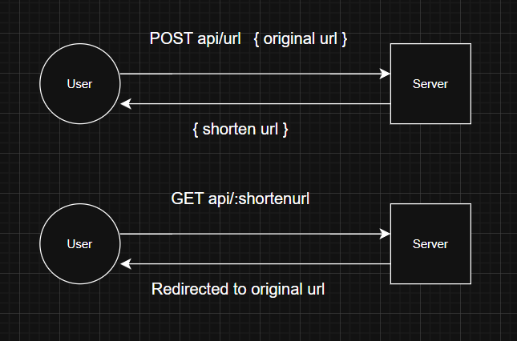
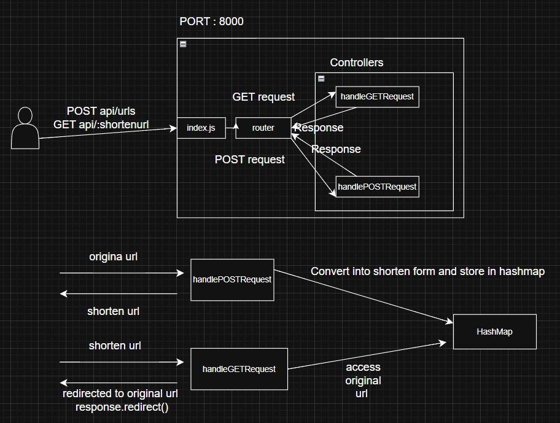

# URL-Shortner

This repository contain code and description of build of a url shortner from scratch with design . This project is for learning purpose of design application

# Level 1

## Requirement

1. Send a url get a shorten url.
2. make a request with shorten url and get redirected to original url.

## Design

wrote unit test and working on integration test
